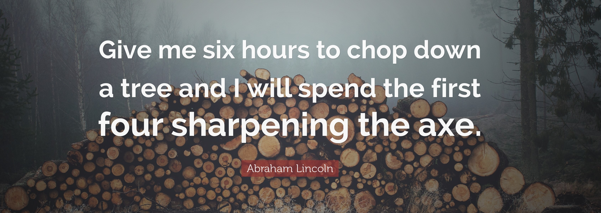
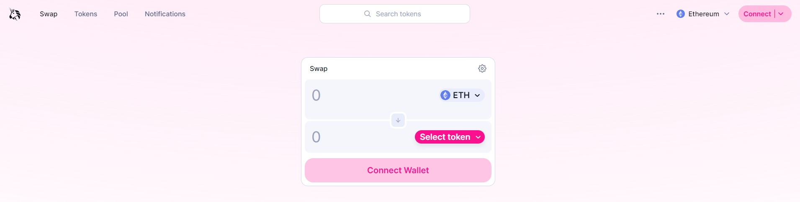
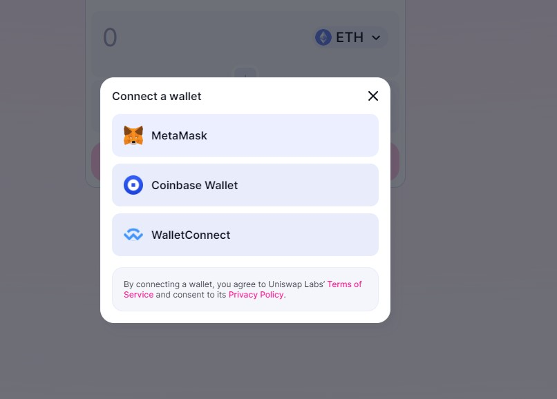
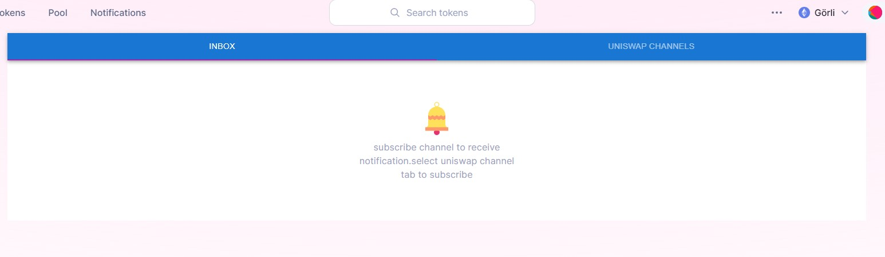
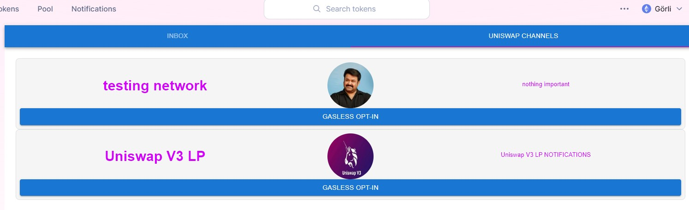
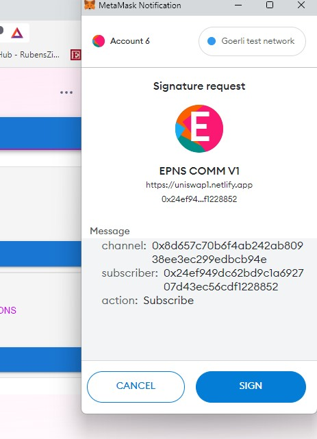

# UNISWAP FORK INTEGRATED WITH PUSH PROTOCOL

## This app has intergrated push protocol to receive web3 notification in the frontend.



**I spent most of my time learning about the push protocol and Uniswap before starting development. This approach was very useful when I started integrating the push protocol into Uniswap.**

# Documentation

## For Frontend Users

Users can acces Push protocol integrated website using this link: [Uinswap](https://uniswap1.netlify.app/#/swap)

Step 1 : **Access the website using the above link provided and you can see tabs like**


<br>

Step 2 :**The next step is to connect your wallet to the uinswap dapp using connect button and select the wallet you have.**


<br>

Step 3 : **To view notifications, the user must select the Notifications tab in the DApp. There you will find the Inbox and Uniswap Channel tabs. The Inbox tab contains notifications received and the Uniswap Channel tab contains channels related to Uniswap.**


<br>
Step 4:

**To receive notifications, users must first subscribe to the channel. To subscribe to a channel, you must select the Uniswap Channels tab. Here you can find channels related to Uniswap. To subscribe, click the GASLESS OPT-IN button and sign the message. There are no transaction fees for subscribing.**



Step 5: **After subscribing to the channel users can view the notifications from the subscribed channel in the inbox tab.**

These are the steps required for a frontend user to receive notifications in a DApp.

## For developers

**Developers can easily add new channels by adding the channel details to the channelsinfo file in the constants folder**

```
.
├── ...
├── src
     ├── constants
              ├── channelinfo.tsx #Edit this file and add channel details according to the format in the file.

```

## Implementation details

### Resources/References

[Push Protocol Developer Docs](https://docs.push.org/developers/) <br>
[How to integrate a frontend - Push Protocol](https://docs.push.org/developers/developer-guides/integrating-on-frontend) <br>
[push-for-hackers repo](https://github.com/ethereum-push-notification-service/push-for-hackers) <br>
[Web3 notification integrating tutorial by Harsh Rajat](https://www.youtube.com/watch?v=ZCgl1XGD6yM) <br>

**PUSH notifications are integrated into Uniswap fortend using the PUSH Restful API (Best for Frontend Integration).**

**Front-end integration requires user notifications and channel subscriptions. You need the PUSH SDK for that**

```
# install the sdk "restapi" package & its peer dependencies in your app

yarn add @epnsproject/sdk-restapi ethers

# or,

npm install @epnsproject/sdk-restapi ethers
```

**Fetching the user channel subscriptions using Restful API**

```typescript
const fetchData = async () => {
      const data = await EpnsAPI.user.getSubscriptions({
        user: account, // user address in CAIP or in address if defaulting to Ethereum
        env: 'staging',
      })

```

This fetchData method allow us to fetch user channel subscriptions. while calling the function we are passing two parameters user(user wallet address) and env(repersenting the netwok production|testing) staging repersents test network.

**Fetching the user Notifications using Restful API**

```typescript
const fetchData = async () => {
      const data = await EpnsAPI.user.getFeeds({
        user: `eip155:5:${account}`, // user address in CAIP or in address if defaulting to Ethereum
        env: "staging",
      });

```

This fetchData method allow us to fetch user notifications.

**Subscribe channel**

```typescript
await EpnsAPI.channels.subscribe({
  signer: library.getSigner(),
  channelAddress: `eip155:5:${yourChannel}`, // channel address in CAIP
  userAddress: `eip155:5:${account}`, // user address in CAIP
  onSuccess: () => {
    console.log('opt in success')
  },
  onError: () => {
    console.error('opt in error')
  },
  env: 'staging',
})
```

**Unsubscribe channel**

```typescript
await EpnsAPI.channels.unsubscribe({
  signer: library.getSigner(), // user signer address for signing the transaction.
  channelAddress: `eip155:5:${yourChannel}`, // channel address in CAIP.
  userAddress: `eip155:5:${account}`, // user address in CAIP.
  onSuccess: () => {},
  onError: () => {
    console.error('opt out error')
  },
  env: 'staging',
})
```

**For displaying notfication in frontend pushprotocol/uiweb is needed**

```
yarn add @pushprotocol/uiweb  #you can install uiweb using this command
yarn add styled-components    #styled-components is a peerDependency. Please install it in your dApp if you don't have it already!
```

`@pushprotocol/uiweb` has needed `@pushprotocol/restapi` package also. Here we are using `epnsproject/sdk-restapi` and we need to make some changes in uiweb to work with epnsproject/sdk-restapi

## **FRONTEND WORKING**

For receiving notfication user need to acces the `push protocol` integrated uniswap page. From the main page user need to access the notification page to receive notifications.
code for notification page is available in `src\pages\Push\index.tsx`

For wallet connection and information uniswap uses `web3-react` packages. At a high level, web3-react is a state machine which ensures that certain key pieces of data (the user's current account, for example) relevant to your dApp are kept up-to-date.web3-react uses Context to efficiently store this data, and inject it wherever you need it in your application.

```typescript
import { useWeb3React } from '@web3-react/core'
const { account, chainId, provider } = useWeb3React()
```

account: current wallet address of wallet connect<br>
chainId: network chainid of current connection <br>
provider: used to interact with wallet <br>

Here ` useState()` is react Hook track state in a function component like notifications, user subscribed channels etc.<br>

For fetching the information using push restapi `useEffect` hook is used

```typescript
useEffect(() => {
  const fetchData = async () => {
    const data = await EpnsAPI.user.getFeeds({
      user: `eip155:${chainId}:${account}`, // user address in CAIP or in address if defaulting to Ethereum
      env: 'staging',
    })
    setNotification(data)
    setCount(usercount + 1)
  }
  if (account) {
    console.log('Calling user details')
    fetchData().catch(console.error)
  }
}, [account])
```

Above code will fetch the user noftications. chainId and account information are provided from the `web3-react`.
<br>

```typescript
// fetching user channel subscriptions
useEffect(() => {
  const fetchData = async () => {
    const data = await EpnsAPI.user.getSubscriptions({
      user: account, // user address in CAIP or in address if defaulting to Ethereum
      env: 'staging',
    })

    let channels: string[] = []
    channels = []
    for (let i = 0; i < data.length; i++) {
      const element = data[i]
      console.log(element.channel)
      if (yourChannel.includes(element.channel)) {
        // setChannelOptStatus([])
        if (!channels.includes(element.channel)) {
          channels.push(element.channel)
        }
      }
    }
    setChannelOptStatus(channels)
  }

  if (account) {
    console.log('Calling user details')
    fetchData().catch(console.error)
  }
}, [account])
```

Above code will fetch user channel subscriptions and checks users subscribed to dapp related channels.
<br>

```typescript
 {notifications.map((oneNotification, i) => {
                  const { cta, title, message, app, icon, image, url, blockchain, secret, notification } =
                    oneNotification
                  return (
                    <NotificationItem
                      key={`notif-${i}`}
                      notificationTitle={secret ? notification['title'] : title}
                      notificationBody={secret ? notification['body'] : message}
                      cta={cta}
                      app={app}
                      icon={icon}
                      image={image}
                      url={url}
                      theme={'light'}
                      chainName={blockchain as chainNameType}
                    />
                  )
                }
```

Above code will display notifications to front end of the uniswap dapp. `@pushprotocol/uiweb` web components is used by dApp for notification displaying.

For channel OPT-IN and OPT-OUT a seperate component is created. source code is available in `src\components\pushnotification`.
